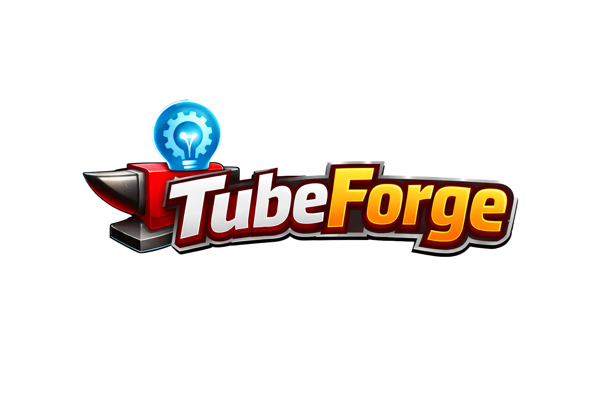

<div align="center">


### AI-Powered Content Creation Assistant for YouTubers

<p>
  
  
  
  
</p>

<p>
  
  
  
  
</p>

---

*Generate video ideas, full scripts, and thumbnail briefs — all from one interface.*  
*Stop staring at a blank screen. Start creating.*

</div>

---

## Overview

TubeForge is a web-based AI assistant built specifically for YouTubers. It compresses hours of pre-production work into minutes by generating ready-to-use content through three core tools — all powered by a secure Spring Boot backend and the OpenRouter AI API.

---

## Features

<table>
  <tr>
    <td align="center" width="33%">
      <br/><br/>
      Enter your niche and receive 5–8 click-worthy, high-CTR title ideas crafted for YouTube's algorithm.
    </td>
    <td align="center" width="33%">
      <br/><br/>
      Turn any title into a production-ready script with Hook, Intro, Main Content, CTA, and Outro — including timing cues.
    </td>
    <td align="center" width="33%">
      <br/><br/>
      Get a detailed creative brief covering text, background, color palette, expressions, and style — ready for any designer.
    </td>
  </tr>
</table>

- **Secure API Proxy** — Your API key lives server-side only, never exposed to the browser
- **Copy to Clipboard** — One-click copy on all generated outputs
- **Responsive UI** — Clean interface that works on desktop and mobile
- **Zero external frontend dependencies** — Pure HTML, CSS, and JavaScript

---

## Tech Stack

<table>
  <tr>
    <th>Layer</th>
    <th>Technology</th>
  </tr>
  <tr>
    <td><strong>Backend</strong></td>
    <td>
      
      
      
    </td>
  </tr>
  <tr>
    <td><strong>Frontend</strong></td>
    <td>
      
      
      
    </td>
  </tr>
  <tr>
    <td><strong>AI Service</strong></td>
    <td>
      
      
    </td>
  </tr>
  <tr>
    <td><strong>Utilities</strong></td>
    <td>
      
      
    </td>
  </tr>
</table>

---

## Project Structure

```
TubeForge/
├── assets/
│   └── logo.svg                             # Project logo
├── pom.xml
└── src/main/
    ├── java/com/tubeforge/
    │   ├── TubeForgeApplication.java        # Application entry point
    │   ├── config/
    │   │   └── CorsConfig.java              # CORS configuration
    │   ├── controller/
    │   │   └── AIController.java            # REST API endpoints
    │   ├── service/
    │   │   └── AIService.java               # AI logic & OpenRouter integration
    │   └── model/
    │       ├── AIRequest.java               # Incoming request model
    │       └── AIResponse.java              # Outgoing response model
    └── resources/
        ├── application.properties           # Config & API settings
        ├── prompts/
        │   ├── ideas-prompt.txt
        │   ├── script-prompt.txt
        │   └── thumbnail-prompt.txt
        └── static/
            ├── index.html
            ├── style.css
            └── app.js
```

---

## How To Run

### Prerequisites

<p>
  
  
</p>

Verify your versions:
```bash
java -version
mvn -version
```

---

### Step 1 — Get an API Key

Sign up at [openrouter.ai](https://openrouter.ai) and generate a free API key.

---

### Step 2 — Configure

Edit `src/main/resources/application.properties`:

```properties
openrouter.api.key=your_api_key_here
openrouter.api.url=https://openrouter.ai/api/v1/chat/completions
openrouter.model=qwen/qwen3-next-80b-a3b-instruct:free
openrouter.max-tokens=1500
```

---

### Step 3 — Build & Run

```bash
mvn spring-boot:run
```

---

### Step 4 — Open in Browser

```
http://localhost:8080
```

---

## API Reference

| Method | Endpoint | Required Fields | Description |
|--------|----------|-----------------|-------------|
| `POST` | `/api/ideas` | `niche`, `audience` | Generate 5–8 video title ideas |
| `POST` | `/api/script` | `title`, `audience` | Generate a full production script |
| `POST` | `/api/thumbnail` | `title` | Generate a thumbnail design brief |

All endpoints return:
```json
{
  "result": "...",
  "success": true,
  "error": null
}
```

### Example Requests

```bash
# Video ideas
curl -X POST http://localhost:8080/api/ideas \
  -H "Content-Type: application/json" \
  -d '{"niche": "tech reviews", "audience": "tech enthusiasts"}'

# Full script
curl -X POST http://localhost:8080/api/script \
  -H "Content-Type: application/json" \
  -d '{"title": "Best Budget Laptops 2025", "audience": "students"}'

# Thumbnail brief
curl -X POST http://localhost:8080/api/thumbnail \
  -H "Content-Type: application/json" \
  -d '{"title": "Best Budget Laptops 2025"}'
```

---

## Architecture

```
┌──────────────────────────────────┐
│         Browser (Client)         │
│   HTML  +  CSS  +  JavaScript    │
│   Served from Spring Boot        │
└──────────────┬───────────────────┘
               │  HTTP POST /api/...
               ▼
┌──────────────────────────────────┐
│      Spring Boot Backend         │
│   AIController  ->  AIService    │
│   Loads prompts, injects input   │
│   API key never leaves here      │
└──────────────┬───────────────────┘
               │  HTTPS  +  Bearer Token
               ▼
┌──────────────────────────────────┐
│        OpenRouter AI API         │
│   Model: Qwen3-Next-80B          │
└──────────────────────────────────┘
```

The backend acts as a **secure proxy** — it manages prompt templates, injects user input, and communicates with the AI. The API key is never sent to the client.

---

## Security

| Area | Implementation |
|------|----------------|
| API Key | Stored server-side in `application.properties` only — never exposed to the browser |
| Input Validation | All fields validated before processing; returns `400 Bad Request` on invalid input |
| CORS | Restricted to `localhost:8080` and `localhost:3000` only |
| Error Handling | Exceptions caught gracefully; user-friendly error messages returned |

---

## Roadmap

- [ ] User authentication and personal dashboards
- [ ] Save and manage generation history
- [ ] SEO keyword analysis and tag suggestions
- [ ] YouTube description generator
- [ ] Multiple AI model options
- [ ] Multilingual support
- [ ] YouTube API direct integration
- [ ] Team collaboration workspaces

---

## Contributing

1. Fork the repository
2. Create a new branch

```bash
git checkout -b feature/your-feature-name
```

3. Commit your changes

```bash
git commit -m "Add your feature"
```

4. Push and open a pull request

```bash
git push origin feature/your-feature-name
```

---

## License

This project is licensed under the **MIT License** — free to use, modify, and distribute.

---

<div align="center">



*Built to help creators spend less time planning and more time creating.*

</div>
