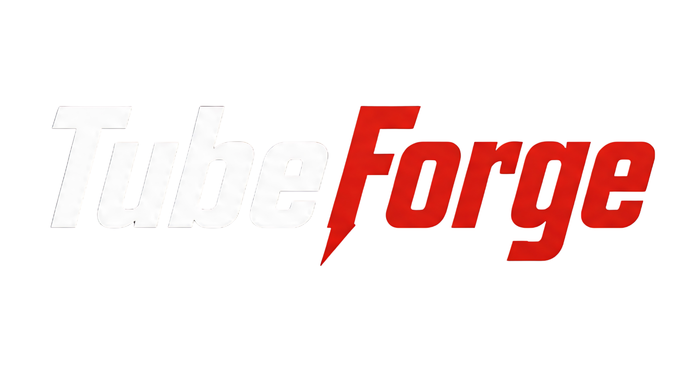
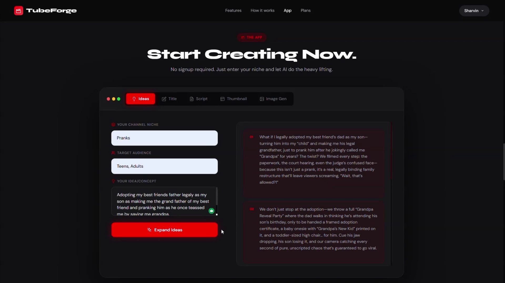
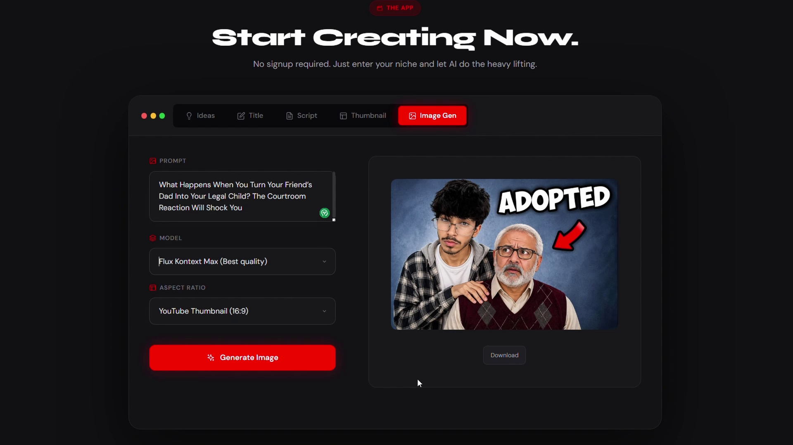
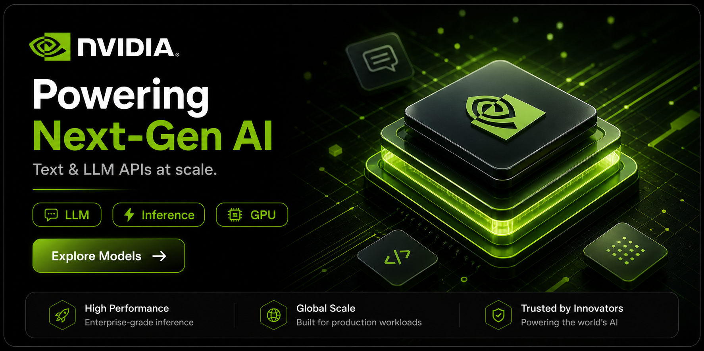
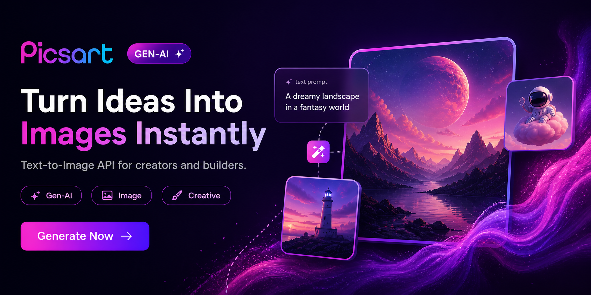

<div align="center">



### AI-Powered Content Creation Studio for YouTubers

<p>
  
  
  
  
  
</p>

<p>
  
  
  
  
</p>

---

*Generate video ideas, full scripts, thumbnail briefs & AI images — all from one interface.*  
*Stop staring at a blank screen. Start creating.*

</div>

---

## Key Features

<table>
  <tr>
    <td align="center" width="20%">
      <br/><br/>
      <strong>Idea Generator</strong><br/>
      Enter your niche and receive 5-8 click-worthy, high-CTR title ideas crafted for YouTube's algorithm.
    </td>
    <td align="center" width="20%">
      <br/><br/>
      <strong>Title Generator</strong><br/>
      Turn any idea into 5-7 viral titles with tone, hook style, and keyword optimization.
    </td>
    <td align="center" width="20%">
      <br/><br/>
      <strong>Script Generator</strong><br/>
      Turn any title into a production-ready script with Hook, Intro, Main Content, CTA, and Outro.
    </td>
    <td align="center" width="20%">
      <br/><br/>
      <strong>Thumbnail Brief</strong><br/>
      Get a detailed creative brief covering text, background, color palette, expressions, and style.
    </td>
    <td align="center" width="20%">
      <br/><br/>
      <strong>Image Generator</strong><br/>
      Generate custom thumbnails and visuals with AI using multiple aspect ratios.
    </td>
  </tr>
</table>

### Additional Features

- **Secure API Proxy** — Your API keys live server-side only, never exposed to the browser
- **Click-to-Use Workflow** — Ideas → Titles → Scripts → Thumbnails → Images in one flow
- **Membership System** — Free, Basic (₹149), Pro (₹349), Premium (₹699 Lifetime)
- **Copy to Clipboard** — One-click copy on all generated outputs
- **Responsive UI** — Clean dark interface that works on desktop and mobile
- **Zero External Frontend Dependencies** — Pure HTML, CSS, and JavaScript

---

## Tech Stack

<table>
  <tr>
    <th>Layer</th>
    <th>Technology</th>
  </tr>
  <tr>
    <td><strong>Backend</strong></td>
    <td>
      
      
      
      
    </td>
  </tr>
  <tr>
    <td><strong>Frontend</strong></td>
    <td>
      
      
      
    </td>
  </tr>
  <tr>
    <td><strong>AI Services</strong></td>
    <td>
      
      
    </td>
  </tr>
  <tr>
    <td><strong>Deployment</strong></td>
    <td>
      
      
      
    </td>
  </tr>
  <tr>
    <td><strong>Utilities</strong></td>
    <td>
      
      
      
    </td>
  </tr>
</table>

---

## Screenshots & Demo

<div align="center">

### Landing Page


### App Interface



</div>

### Demo Videos

<div align="center">

<a href="src/main/resources/Web-Images-Vids/The App.mp4">
  
  <p><em>Watch App Demo →</em></p>
</a>

<a href="src/main/resources/Web-Images-Vids/Thumbnail!!.mp4">
  
  <p><em>Watch Thumbnail Generation →</em></p>
</a>

</div>

---

## Architecture

<div align="center">

```
┌─────────────────────────────────────────────────────────┐
│                        USER                                 │
└─────────────────────────────┬───────────────────────────┘
                          │
                          ▼
┌─────────────────────────────────────────────────────────┐
│                    VERCEL (Frontend)                       │
│  https://tubeforge.vercel.app                              │
│                                                             │
│  • index.html                                           │
│  • payment.html                                        │
│  • login.html                                        │
│  • app.js → calls Railway API                          │
└─────────────────────────────┬───────────────────────────┘
                            │
         ┌──────────────────┴──────────────────┐
         │                                   │
         ▼                                   ▼
   Direct API (mock)                   Railway API
   /api/* (fails)         ──────►  https://tubeforge-xxx.railway.app/api/*
                                    │
                                    ▼
                         ┌────────────────────────────────┐
                         │   SPRING BOOT BACKEND            │
                         │   • /api/ideas                 │
                         │   • /api/title                │
                         │   • /api/script               │
                         │   • /api/thumbnail            │
                         │   • /api/image/generate       │
                         │   • /api/payment/verify       │
                         │   • /api/membership/status    │
                         └───────────┬──────────────────────┘
                                     │
                         ┌─────────┴─────────┐
                         │                        │
                         ▼                        ▼
              ┌─────────────────┐    ┌─────────────────┐
              │   NVIDIA API    │    │  Picsart API   │
              │   (Qwen3-Next) │    │   (Image Gen)  │
              └─────────────────┘    └─────────────────┘
```

</div>

### How It Works

| Request | Goes To |
|---------|--------|
| `vercel.app/` | Vercel → index.html |
| `vercel.app/payment` | Vercel → payment.html |
| `vercel.app/api/ideas` | Vercel → tries backend (404) |
| `app.js` calls Railway | Works → returns AI response |

---

## Project Structure

```
TubeForge/
├── src/main/java/com/tubeforge/     # Backend (Spring Boot)
│   ├── TubeForgeApplication.java     # Main class
│   ├── controller/                  # REST APIs
│   │   ├── AIController.java       # /api/ideas, /api/title, /api/script, /api/thumbnail
│   │   ├── PaymentController.java # /api/payment/verify, /api/membership/status
│   │   └── ImageController.java  # /api/image/generate
│   ├── service/                     # Business logic
│   │   ├── AIService.java
│   │   ├── ImageService.java
│   │   └── MembershipService.java
│   ├── model/                     # Data models
│   │   ├── AIRequest.java
│   │   ├── AIResponse.java
│   │   ├── Membership.java
│   │   └── PaymentVerifyRequest.java
│   └── config/
│       └── CorsConfig.java       # CORS configuration
├── src/main/resources/
│   ├── static/                   # Frontend (HTML/CSS/JS)
│   │   ├── index.html
│   │   ├── login.html
│   │   ├── payment.html
│   │   ├── app.js
│   │   └── style.css
│   ├── prompts/                  # AI prompt templates
│   │   ├── ideas-prompt.txt
│   │   ├── title-prompt.txt
│   │   ├── script-prompt.txt
│   │   └── thumbnail-prompt.txt
│   └── application.properties    # Backend config
├── pom.xml                       # Maven config
├── Dockerfile                   # Railway deployment
├── railway.json                # Railway config
├── vercel.json                # Vercel config
└── .env.example               # Environment template
```

---

## Quick Start

### Prerequisites

| Requirement | Version | Check | Notes |
|--------------|---------|-------|-------|
| [Java](https://www.oracle.com/java/technologies/downloads/) | 17+ | `java -version` | Backend runtime |
| [Maven](https://maven.apache.org/) | 3.6+ | `mvn -version` | Build tool |
| [PostgreSQL](https://www.postgresql.org/) | 12+ | `psql --version` | Database (Railway provides this) |

> **Windows only:** If you don't have Visual Studio, install [Visual Studio Build Tools](https://visualstudio.microsoft.com/visual-cpp-build-tools/) and ensure the **Desktop development with C++** workload is selected.

### Option A — Local Development

**1. Clone the repository**

```bash
git clone https://github.com/szg-zone/TubeForge.git
cd TubeForge
```

**2. Configure environment**

```bash
cp .env.example .env
```

Edit `.env` and fill in:

```properties
# Server
SERVER_PORT=8080

# PostgreSQL (Railway provides these)
PGHOST=postgres.railway.internal
PGPORT=5432
PGDATABASE=railway
PGUSER=postgres
PGPASSWORD=your_railway_password

# NVIDIA AI
NVIDIA_API_KEY=nvapi-xxxx...
NVIDIA_API_URL=https://integrate.api.nvidia.com/v1/chat/completions
NVIDIA_MODEL=qwen/qwen3-next-80b-a3b-instruct
NVIDIA_MAX_TOKENS=4096

# Picsart
PICSART_API_KEY=paat-xxxx...
```

**3. Build & Run**

```bash
# Build
mvn clean package -DskipTests

# Run
java -jar target/tubeforge-1.0.0.jar
```

Open [http://localhost:8080](http://localhost:8080) in your browser.

---

## Deployment Guide

### Backend (Railway)

Railway is where the Spring Boot backend runs.

**1. Create Railway Project**
- Go to [railway.app](https://railway.app)
- **New Project** → **Deploy from GitHub**
- Select `szg-zone/TubeForge`
- Railway will auto-detect the `Dockerfile`

**2. Add PostgreSQL Service**
- In your Railway project, click **New Service** → **Database** → **PostgreSQL**
- Railway will automatically inject `DATABASE_URL` and other `PG*` variables

**3. Set Environment Variables**

| Variable | Value |
|----------|-------|
| `NVIDIA_API_KEY` | Your NVIDIA API key |
| `PICSART_API_KEY` | Your Picsart API key |
| `DATABASE_URL` | Auto-injected by Railway |

**4. Deploy**

Railway auto-deploys on push to `main`. After deploy, get your URL:
```
https://tubeforge-production-xxxx.railway.app
```

**5. Update Frontend API Base**

Once Railway is deployed, update `API_BASE` in:

- `src/main/resources/static/app.js` (line 4)
- `src/main/resources/static/index.html` (line 830)
- `src/main/resources/static/payment.html` (line 85)

```javascript
// Change FROM:
const API_BASE = '';

// Change TO (your Railway URL):
const API_BASE = 'https://tubeforge-production-xxxx.railway.app';
```

Then push to GitHub - Vercel will auto-deploy.

---

### Frontend (Vercel)

Vercel serves the static HTML/CSS/JS files.

**1. Create Vercel Project**
- Go to [vercel.com](https://vercel.com)
- **New Project** → Import `szg-zone/TubeForge`
- Framework Preset: **Other**
- Build Command: (leave empty)
- Output Directory: (leave empty)

**2. Configuration**

The `vercel.json` file handles routing:

```json
{
  "outputDirectory": "target/classes/static",
  "rewrites": [
    { "source": "/payment", "destination": "/payment.html" },
    { "source": "/login", "destination": "/login.html" },
    { "source": "/api/(.*)", "destination": "/api/$1" },
    { "source": "/(.*)", "destination": "/index.html" }
  ]
}
```

**3. Deploy**

Vercel auto-deploys from `main` branch. Your frontend will be at:
```
https://tubeforge.vercel.app
```

---

## Environment Variables Reference

| Variable | Required | Description |
|----------|----------|-------------|
| `NVIDIA_API_KEY` | **Yes** | NVIDIA API key for AI text generation |
| `PICSART_API_KEY` | **Yes** | Picsart API key for image generation |
| `DATABASE_URL` | Auto | PostgreSQL connection (Railway injects this) |
| `PGHOST` | Railway | PostgreSQL host |
| `PGPORT` | Railway | PostgreSQL port (5432) |
| `PGDATABASE` | Railway | Database name |
| `PGUSER` | Railway | Database user |
| `PGPASSWORD` | Railway | Database password |
| `SERVER_PORT` | No | Backend port (default: 8080) |

---

## API Reference

### Available Endpoints

| Method | Endpoint | Required Fields | Description |
|--------|----------|-----------------|-------------|
| `POST` | `/api/ideas` | `niche`, `audience` | Generate 5-8 video title ideas |
| `POST` | `/api/title` | `idea`, `niche` | Generate 5-7 viral titles |
| `POST` | `/api/script` | `title`, `audience` | Generate full production script |
| `POST` | `/api/thumbnail` | `title` or `idea` | Generate thumbnail design brief |
| `POST` | `/api/image/generate` | `prompt`, `model` | Generate AI images (Picsart) |
| `POST` | `/api/payment/verify` | `email`, `utr`, `plan` | Verify UPI payment |
| `GET` | `/api/membership/status` | `email` | Check membership status |

### Example Requests

```bash
# Video ideas
curl -X POST http://localhost:8080/api/ideas \
  -H "Content-Type: application/json" \
  -d '{"niche": "tech reviews", "audience": "tech enthusiasts"}'

# Script generation
curl -X POST http://localhost:8080/api/script \
  -H "Content-Type: application/json" \
  -d '{"title": "Best Budget Laptops 2026", "audience": "students"}'

# Thumbnail brief
curl -X POST http://localhost:8080/api/thumbnail \
  -H "Content-Type: application/json" \
  -d '{"title": "Best Budget Laptops 2026"}'

# Image generation (via frontend JavaScript)
# Direct call to Picsart API from browser
```

### Response Format

All endpoints return:

```json
{
  "result": "...AI generated text...",
  "success": true,
  "error": null
}
```

---

## Membership Plans

| Plan | Price | Duration | Daily Requests | Features |
|------|-------|----------|----------------|----------|
| **Free** | ₹0 | Forever | 15 | Ideas + Script only |
| **Basic** | ₹149 | 24 days | 10 | Ideas + Script |
| **Pro** | ₹349 | 24 days | 25 | All features + Thumbnail |
| **Premium** | ₹699 | Lifetime | Unlimited | All features + Priority support |

### Payment Methods

- UPI (GPay, PhonePe, Paytm)
- QR code scanning
- Manual UTR verification

---

## Database Schema

### Membership Table

| Field | Type | Description |
|-------|------|-------------|
| `email` | String | User email (primary key) |
| `plan` | String | free / basic / pro / premium |
| `daily_limit` | int | Requests per day |
| `used_today` | int | Requests used today |
| `expires_at` | Date | Membership expiry |
| `active` | boolean | Membership status |

### Features

- Automatic daily reset of `used_today`
- Plan-based feature access (thumbnail for Pro+)
- Request counting with limit enforcement

---

## Sponsors

<div align="center">

### AI Services
<a href="https://www.nvidia.com/en-us/ai-enterprise/">
  
</a>
<a href="https://picsart.com/">
  
</a>

</div>

---

## Roadmap

- [x] Video Idea Generator
- [x] Title Generator
- [x] Script Generator
- [x] Thumbnail Brief Generator
- [x] Image Generator (Picsart API)
- [x] Membership System
- [x] Payment Integration (UPI/QR)
- [x] Login/Signup System
- [ ] User authentication with JWT
- [ ] Save and manage generation history
- [ ] SEO keyword analysis
- [ ] YouTube description generator
- [ ] YouTube API direct integration
- [ ] Team collaboration workspaces
- [ ] Multi-language support

---

## Performance

### Build & Deploy Times

| Metric | Time |
|--------|------|
| Maven build (clean package) | ~2-3 minutes |
| Docker build (Railway) | ~3-5 minutes |
| Vercel deploy (frontend) | ~30 seconds |
| API response (ideas) | ~3-5 seconds |
| API response (script) | ~5-8 seconds |

---

## Contributing

We welcome contributions! Here's how to get started:

**1. Fork the repository**

**2. Create a new branch**

```bash
git checkout -b feature/your-feature-name
```

**3. Commit your changes**

```bash
git commit -m "Add your feature"
```

**4. Push and open a Pull Request**

```bash
git push origin feature/your-feature-name
```

### Contribution Guidelines

- Follow existing code style
- Add comments for complex logic
- Test your changes locally
- Update documentation if needed

---

## Troubleshooting

### "JAR not found" on Railway
→ Use Dockerfile - it builds inside Docker container with Java 17

### "404 on /api/*" on Vercel
→ Expected - API calls should go to Railway, not Vercel
→ Check `API_BASE` is set to your Railway URL

### CORS errors
→ Already fixed to allow all origins (`*`)
→ Make sure your Railway URL is correct in frontend files

### Database connection issues
→ Verify `DATABASE_URL` is set in Railway
→ Check PostgreSQL service is in the same project

### Payment verification fails
→ Check UTR number is 10-20 digits
→ Verify payment amount matches selected plan

---

## License

This project is licensed under the **MIT License** - free to use, modify, and distribute.

---

## Contact & Community

<div align="center">

**Project Repository:**  
[https://github.com/szg-zone/TubeForge](https://github.com/szg-zone/TubeForge)

**Issues & Bugs:**  
[https://github.com/szg-zone/TubeForge/issues](https://github.com/szg-zone/TubeForge/issues)

**Live Demo (Frontend):**  
[https://tube-forge-orcin.vercel.app/](https://tube-forge-orcin.vercel.app/)

</div>

---

<div align="center">


*Built to help creators spend less time planning and more time creating.*

</div>
